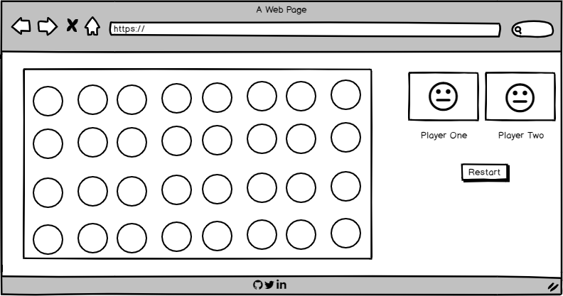
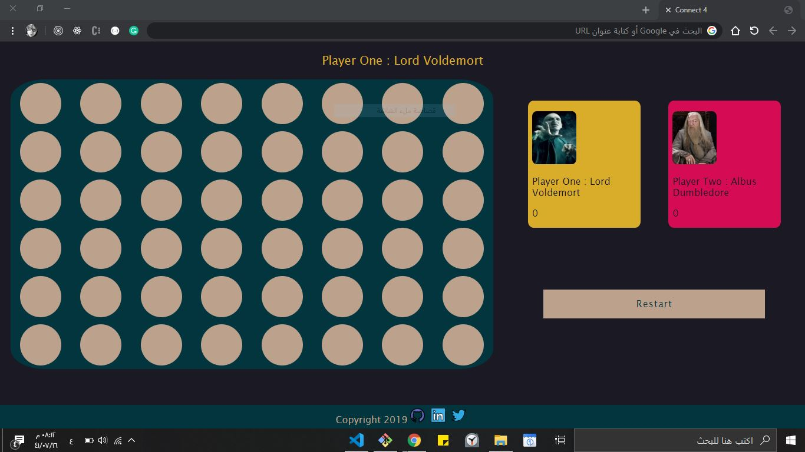

# #Project_1
## (Connect 4) Game

Connect Four (also known as Captain's Mistress, Four Up, Plot Four, Find Four, Four in a Row, Four in a Line, Drop Four,and Gravitrips.

### List technologies used
* HTML(section,div,footer,hedar,img...)
* Css(justify-content,colors,fonts)
* jQuery(function, array, two-dimension array , for loop, if statement,jQuery methods)

### Link to wireframes and user stories.

https://wireframe.cc/pro/pp/bb424799b297036

### tell a story about your development process and problem-solving strategy.>
* read about jQuery.
* start writing simple code to test my idea.
* solving problems by using (console.log)
* remove repeated lines.
* improve my code 

### List unsolved problems which would be fixed in future iterations.
* Create an AI opponent: teach JavaScript to play an unbeatable game against you
* Make my site fully responsive so that it is playable from a mobile phone

### Describe how you solved for the winner
Using for loop 

### link of the game
https://wardahmad.github.io/project_1/

### Image 

